# PKU-VCL-24Fall-Final-Project 大作业报告

# Better Real-Time Shadow 实时软阴影
本项目基于VCX Lab框架，并参考闫令琪老师的 [GAMES202-高质量实时渲染](https://www.bilibili.com/video/BV1YK4y1T7yY/) 课程内容完成。本项目在 Lab3-Rendering 中 Shadow Mapping 的基础之上，实现了实时软阴影。

## 项目运行
由于项目是在 Lab3 的实现之上直接做出更改，xmake 运行命令仍为 ``` xmake run lab3 ```。主要代码在 ``` CaseShadow.cpp ```, ``` CaseShadow.h ```, 以及``` shaders ```文件夹的 ``` phong-shadow.frag ```中。项目只实现了 scenes 物体类场景下的阴影，没有实现 Cube 类场景。
```
git clone https://github.com/Oscarhouhyk/vcx2024-Final-Project.git
cd vcx2024-Final-Project
xmake
xmake run lab3
```

## 项目亮点
1. 同时实现了基于随机均匀圆盘采样以及泊松圆盘采样的实时软阴影算法
2. 实现了自适应Bias 算法
3. 提供参数可供调整软阴影渲染效果
4. 实时渲染下维持较高帧数


## 实现思路
实时软阴影分为两个阶段 1. 在原有Shadow Mapping上实现 PCF (Percentage Closer Filtering)； 2. 利用 PCF 实现 PCSS (Percentage Closer Soft Shadows)。


### PCF
PCF是一种滤波采样器，原理是在对阴影贴图进行采样时，对UV坐标的周围进行多次采样，每次采样时与当前片元的深度值进行比较，将成功采样的平均结果作为权重，混合计算阴影区域的深浅，放弃了原本 lab3 中实现 shadow mapping 的非0即1的硬阴影方法。项目实现了两种采样方法，均匀圆盘采样和泊松圆盘采样。在均匀采样时，利用定义的函数生成随机数，并在圆盘区域内在方向和距离上进行随机采样，但可能会出现一些聚集现象。而在泊松采样时，利用概率分布特性，能确保任何两个点的距离都不会隔得太近。

PCF可以以较小的代价得到软阴影的效果，但没有考虑软阴影的程度变化，所使用的PCF滤波核大小（默认圆盘半径 10）以及采样点数量（默认 50）需要在程序内指定以及根据具体场景变化做出适当调整以达到最佳效果，因此只使用PCF进行阴影渲染还不能准确模拟现实世界中的软阴影效果。

#### 效果图

**Uniform Disk Sampling:**
| Filter Radius = 5 | Filter Radius = 20 |
|:---:|:---:|
|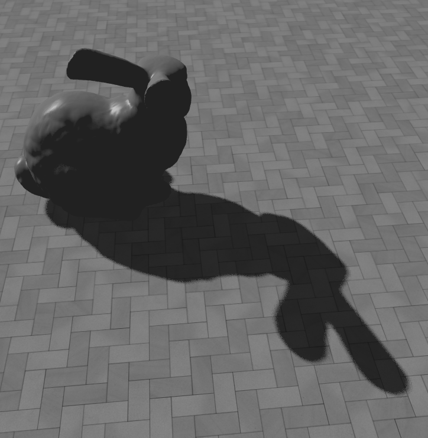|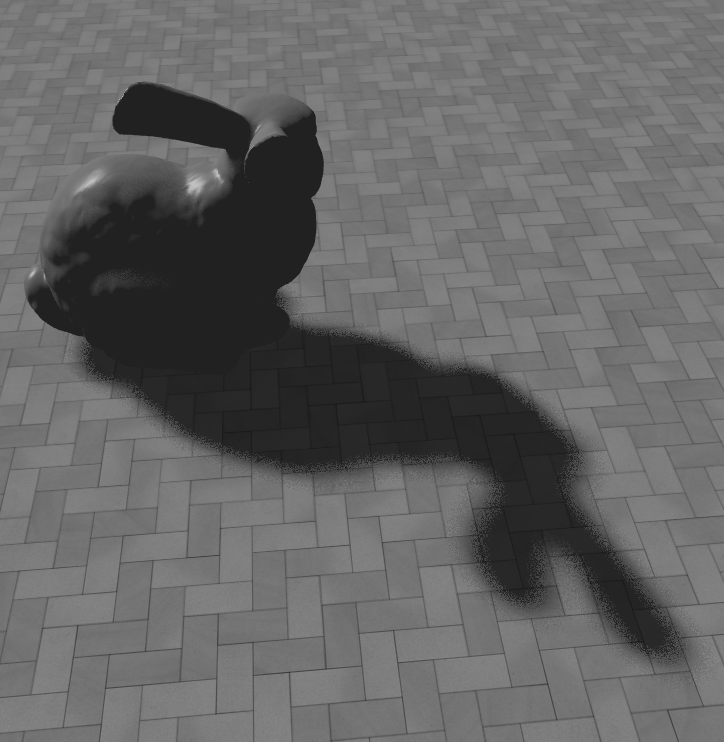|
||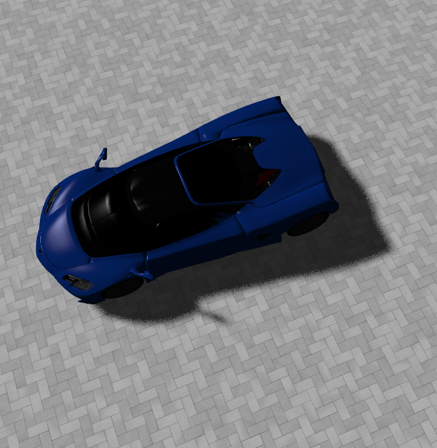|
|||

**Poisson Disk Sampling:**
| Filter Radius = 5 | Filter Radius = 20 |
|:---:|:---:|
|||
|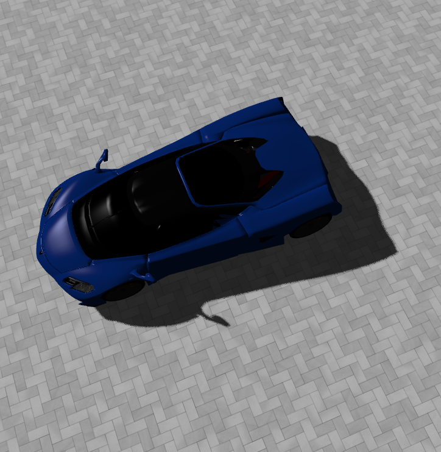||
|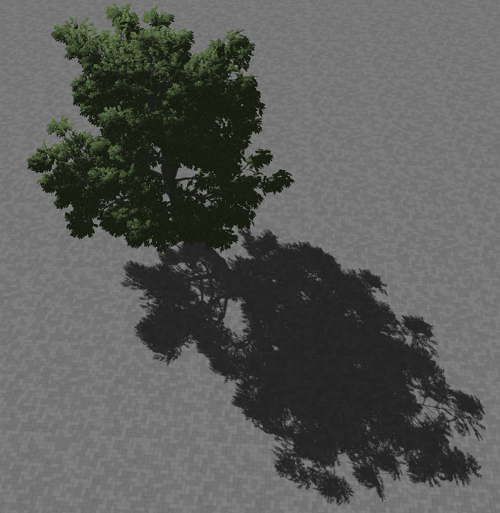||


**对比图（Filter Radius = 20）** 
| Uniform | Poisson |
|:--:|:--:|
||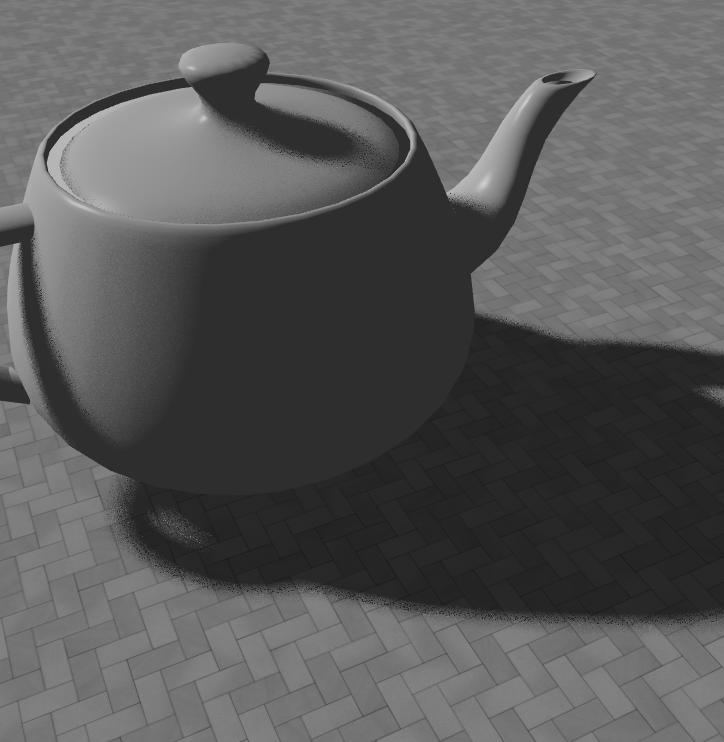|


### PCSS
PCSS 是对 PCF 的优化，加入对阴影与物体距离的考虑，可以实现离物体越远的阴影比离得近的阴影更加模糊的效果，因此PCSS的核心就是如何确定一个点的虚实程度。当一个点离遮挡点越远的时候，阴影显得越虚，由光源大小等参数以及相似三角形，可以得出：
$$ W_{penumbra} = \frac{W_{Light} \cdot (d_{Receiver} - d_{Occluder})}{d_{Occluder}} $$ 其中 $W$ 为宽度，$d$ 为距离。

因此PCSS的计算步骤总结如下：
1. 计算阴影范围内遮挡物的平均深度
2. 计算 Penumbra 作为阴影虚实程度系数
3. 传递参数进行 PCF

#### 效果图 
由于项目加载的模型中，只有 ```white_oak``` 物体较大，可以形成较远的阴影，结果较为明显，可见离树本体越近的阴影较为锐利，远处较为模糊。可以观察到 ``` teapot ``` 的边缘处也有较为明显的模糊滤波处理，生硬的锯齿感有所降低。(Filter Radius = 50)
| Hard Shadow | PCSS |
|:---:|:---:|
|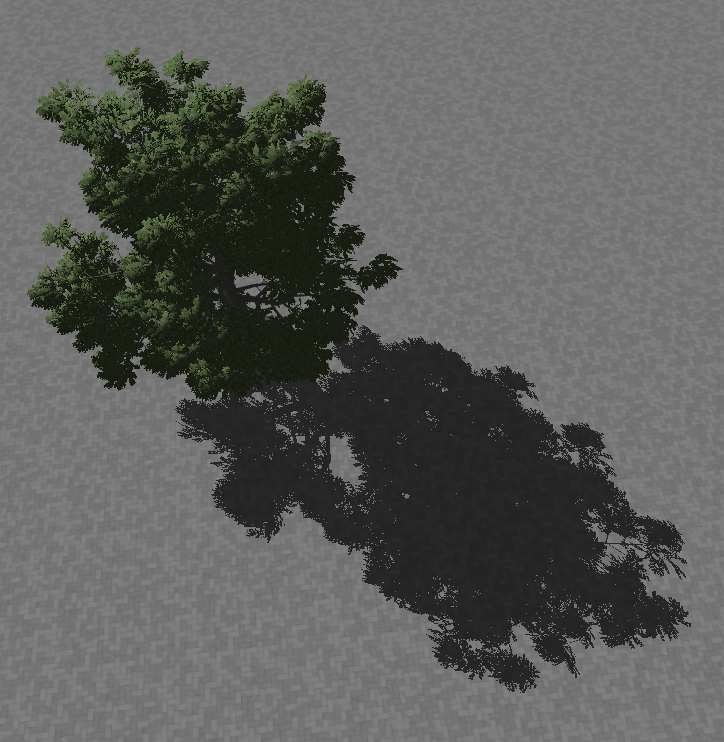|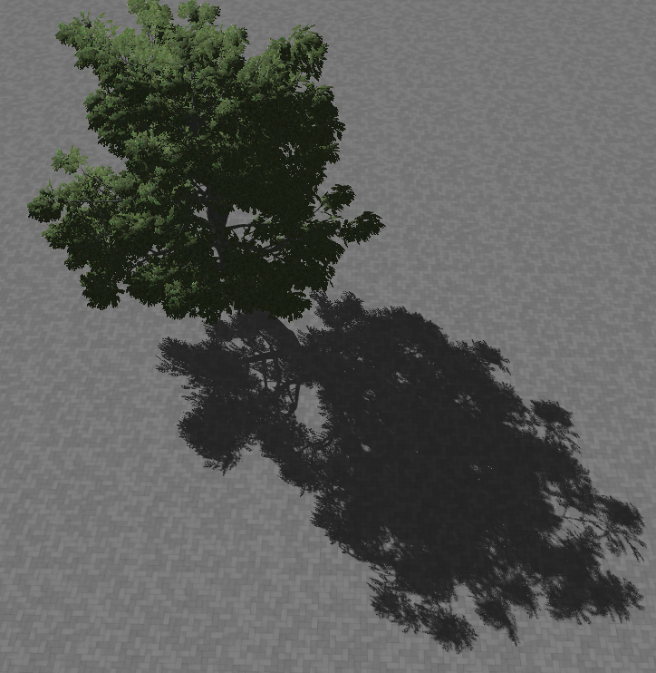|
|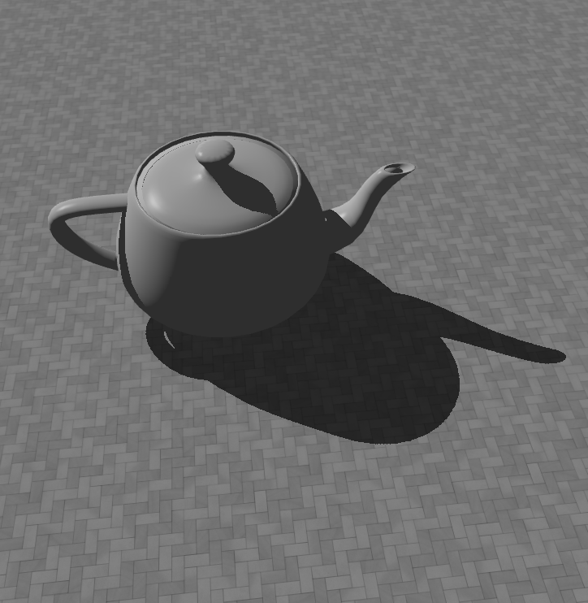|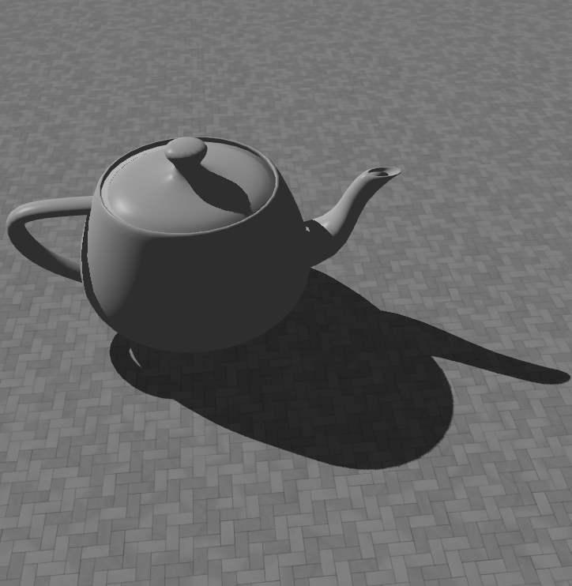|


### 自适应 Bias
Lab3 中 Shadow Mapping框架已包含了对阴影添加偏置量去除自遮挡锯齿的实现，但结果仍会有较不自然的自遮挡出现。本项目参考这篇 [知乎](https://zhuanlan.zhihu.com/p/370951892) 文章，做出了 bias 计算的改进，在 PCF 以及 PCSS 渲染过程中使用自适应 bias。算法与视锥体大小 i.e. 正交矩阵宽高（默认 800），ShadowMap 大小（默认 4096）以及PCF的采样范围（可调）有关。

在项目中，最终计算出的 bias 会乘上一个很小的 bias constant （默认 0.02），可以在 UI 被实时调整以实现最佳渲染效果。注意较大的 bias 值可能导致过度矫正带来的阴影缺失结果,甚至完全消失，较小的值又可能起不到改善自遮挡的效果。

#### 效果图 (soft shadow PCF, uniform sampling)
| bias_constant = 0.02 | bias_constant = 0.10 |
|:---:|:---:|
|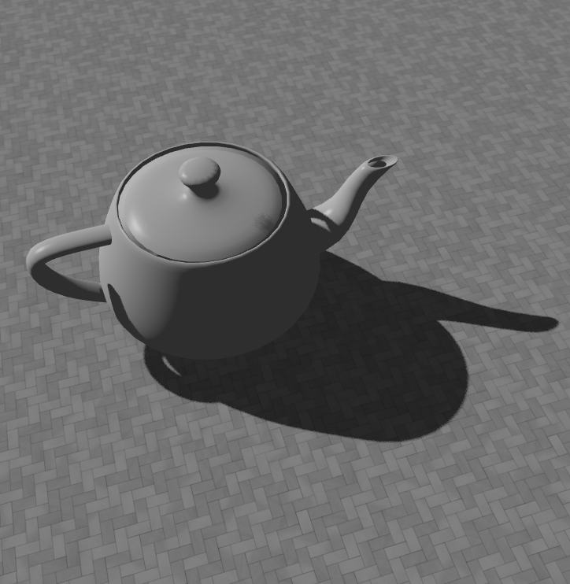||
|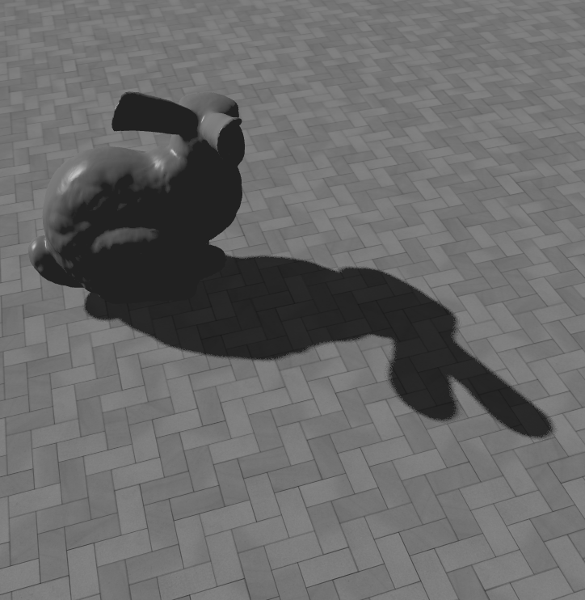|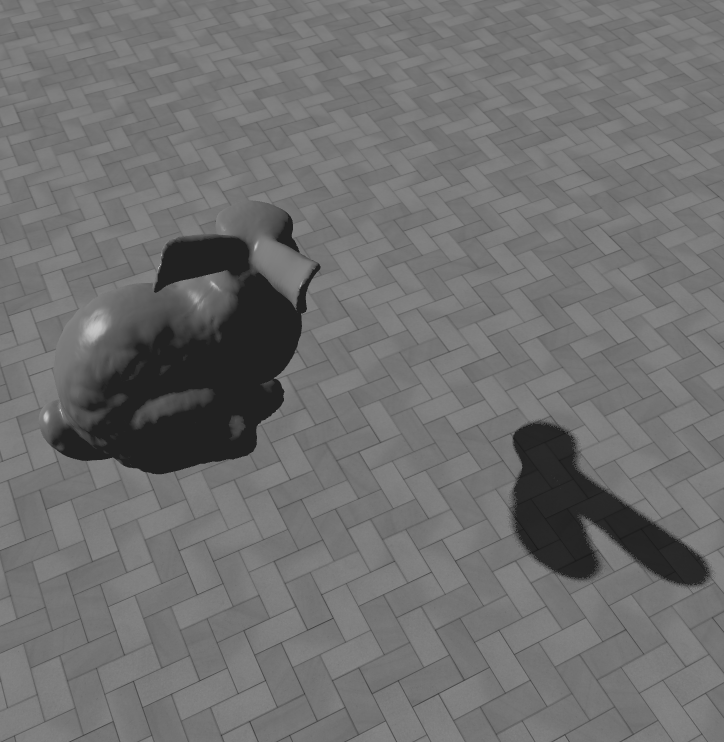|
|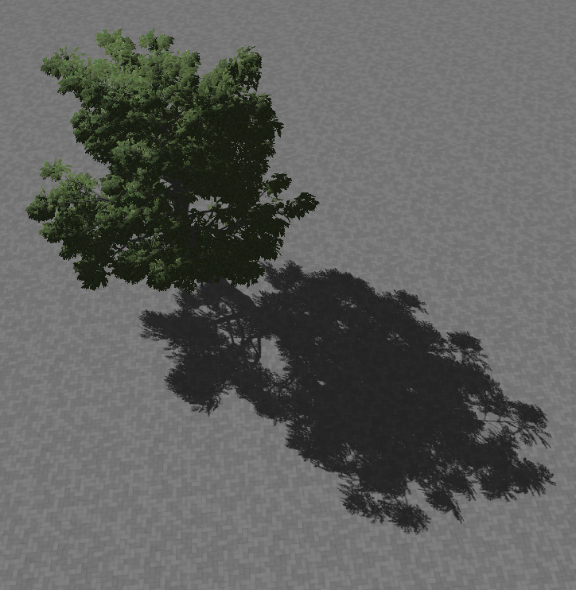|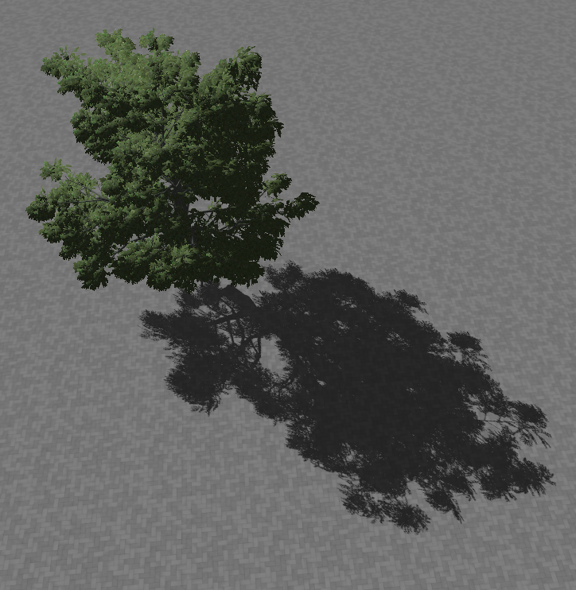|


## UI 界面 & 调参功能
本项目实现 Hard shadow 以及 Soft Shadow 集成在一个 Case 中。 

### 选项栏
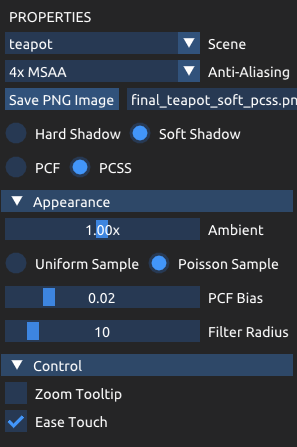

1. 基础选项：场景 (teapot, bunny, sport_car, white_oak)，其中 teapot，bunny 添加了地面；抗锯齿；保存图片；Ease Touch.
2. 硬 / 软阴影选项
3. 如选择软阴影，选择渲染效果为 PCF / PCSS
4. 滑动调整环境光强度 (0.00x - 2.00x)
5. 如选择软阴影，选择随机采样方式：Uniform / Poisson
6. 滑动调整 bias constant (0.00 - 0.10)
7. 滑动调整采样半径大小 (0 - 100)
8. 局部缩放视角 Zoom Tooltip

